# OGK Tattoos

## Welcome to Project 1

This is my first website for my Code Institute Full stack developer course. I have decided to create a website with its main purpose to promote a friend's tattoo studio. Here is a link to the deployed site [https://nomeski80.github.io/OGKTattoo/index.html].

The OGK Tattoo website is a 3 page responsive site that users will be able to view from all media devices. The purpose of the site is to promote the tattoo shop and increase the owner’s online presence and artistic portfolio. The website user will be able to gain an idea as to the ethos of the shop and the artist's work. They will also be able to contact the tatoo shop to ask questions.

## Homepage

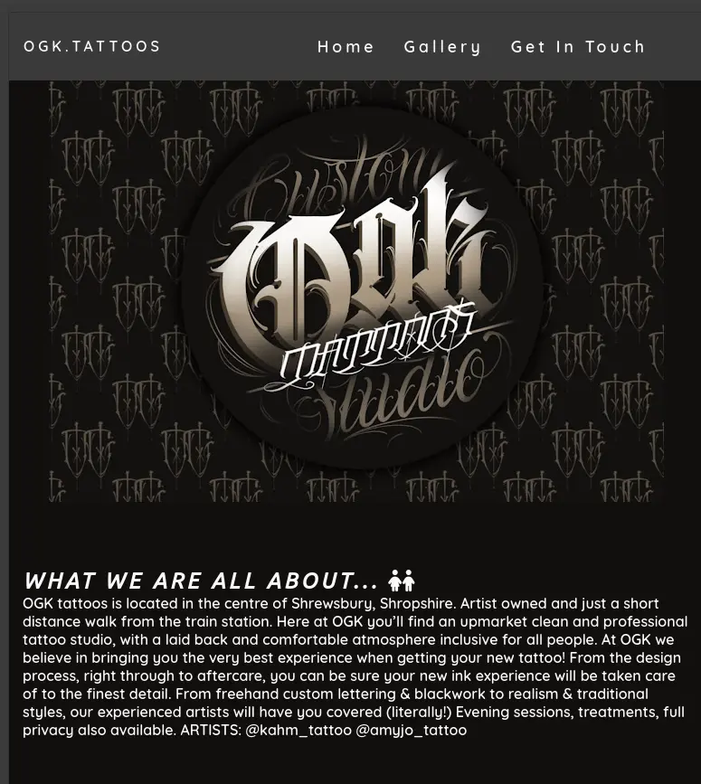

## Get in touch page

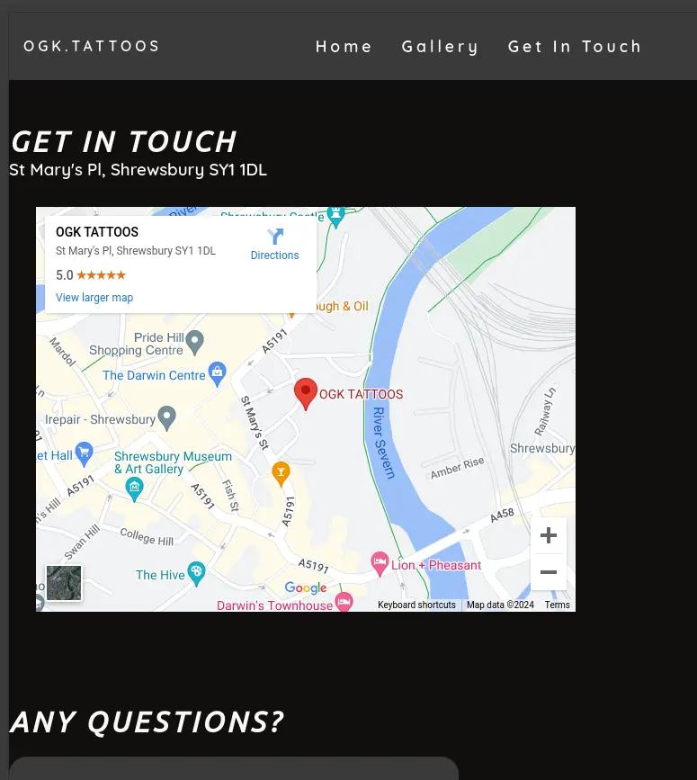

## Gallery

## User stories

Tattoos are big commitments and some people will want to do a lot of research before they fully commit. For this reason the website needs to look clean and simple. It should be easy to navigate and to quickly be able to gain the information needed.

# Design

## Colour scheme

I decided on my colour scheme by taking the OGK logo and inputting it into [https://coolors.co/] This helped me to create a simple palatte that would match and be consistent throughout the site.

## Typography

To create a clean and consistent look, I selected 2 fonts from Google fonts [https://fonts.google.com/] . I picked ubuntu and quicksand as I felt these were clear and easy to read. I also added a backup font of sans-serif to make sure text would be comapatible on all devices.

## Imagery

All of my images were selected with the artist's permission from his Instagram page [https://www.instagram.com/ogk.tattoos/]. After deploying my site about half way through the project the artist said he would like to have more of a say in which images we selected. I am currently waiting for him to get back to me with his choices.
I also used some icons from [https://fontawesome.com/] to help with the user experience and to be sure they could easily skim the website and look for the information they need.

## Wire frames

When planning out the site I used a mixture of Google slides [https://docs.google.com/presentation/d/1TLOV02KnPs9ocgpyYHpHy7TMzvZk3xr9N-EWinmg9XE/edit?usp=sharing] and Jam board [https://jamboard.google.com/d/1QRTlp9HnB9G5tUz_PaER9yE7kofUZKb01CfLKpZWZ3A/edit?usp=sharing] to map out what information I wanted and how I wanted to display this information. I think I would have benefited from spending more time on this with the owner of the shop to help us both get a clear understanding of what we were aiming for early on. In the next project I will look into using Balsamiq and spend more time getting the ideas planned out and clear. I ended up wasting a few days' work by rushing to put the content up but not really thinking through the lay out so I deleted quite a bit and had to start over.

# Features

## General features

Navigation bar and menu, logo and images, responsive menu and images to react to the users device, the OGK logo as the favicon, a map to show where the shop is and links to their social media pages.

## Future features

Perhaps an online booking system could be helpful. Also, more information and details about the artists themselevs. Some information about their licence. Some testimonials.

## Accessability

I have added descriptions of all images to support with screen readers.

# Technologies Used

HTML, CSS , Codeanywhere, Github, Dev tools, cloudconvert.com to convert my images to webp and Favicon.io.

# Credits

I started off the project relying heavily on the tutorials from the Love Running project but after talking with my mentor and exploring other websites and YouTube tutorials I gained a little more confidence in trying out tools like flex box the Box model independently to fit my website, rather than trying to fit new content into the love running set up.

Structure for this README doc was taken from readme-examples [https://github.com/kera-cudmore/readme-examples/blob/main/milestone1-readme.md#user-experience-ux]

All art work and images have come from Jack the tattoo and grafiti aritst as his own work. [https://www.instagram.com/ogk.tattoos/] most from his public page and some sent directly to me from him.

I also used w3schools.com and the code institude tutorials to help me with my understanding of forms.

## What went well, what I managed to fix and what I'm still not happy with

Early on in the project I had trouble with CodeAnywhere but I understand this was happening for lots of people. Since then, it has been working much more smoothly and quickly. I did concidered moving over to GitPod but since it has been working fine now I have stuck with CodeAnywhere.

3/2/24
Menu items do not stay untoggled when on the screens.

Media query says display:block but it still works as a toggle.
The bars for the menu stick to the logo and I can not yet move them to the right. I have tried dev tools to play with padding and flex. I have tried right:0. But i can not seem to get it to work.
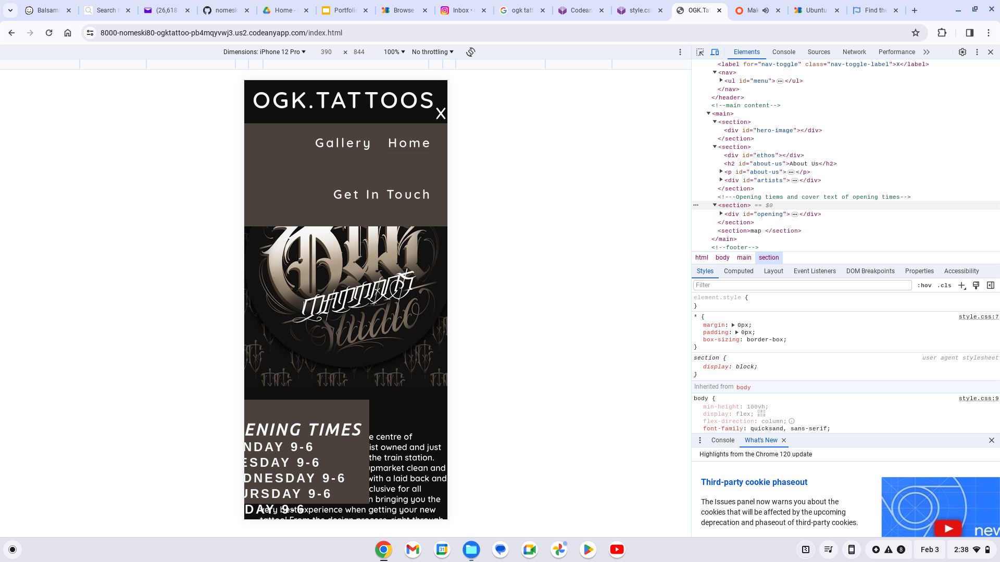

When adding the other pages, I had to delete a lot of the content that was already there so I could copy over the basic structure. This wasn't a big issue as the content was all overlapping and not clear. So starting that section again made more sense than fiddling around.
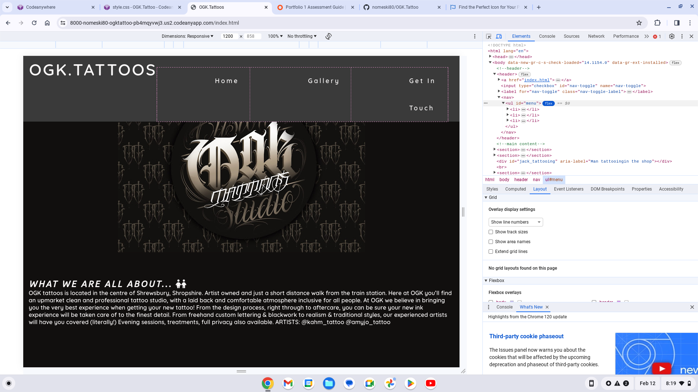

I had forgotten to change the toggle from X to bars icon  in the other pages. Adjustment made.

Media query for gallery is also not working, watched youtube clip to help my understanding of media queries and their format but still not working yet, making the site unresponsive for different devices. After, I took a break for the night when I check again the next day the media query did work. However the images did not look good and were not centred or in the correct places or showing the main part of the image.
 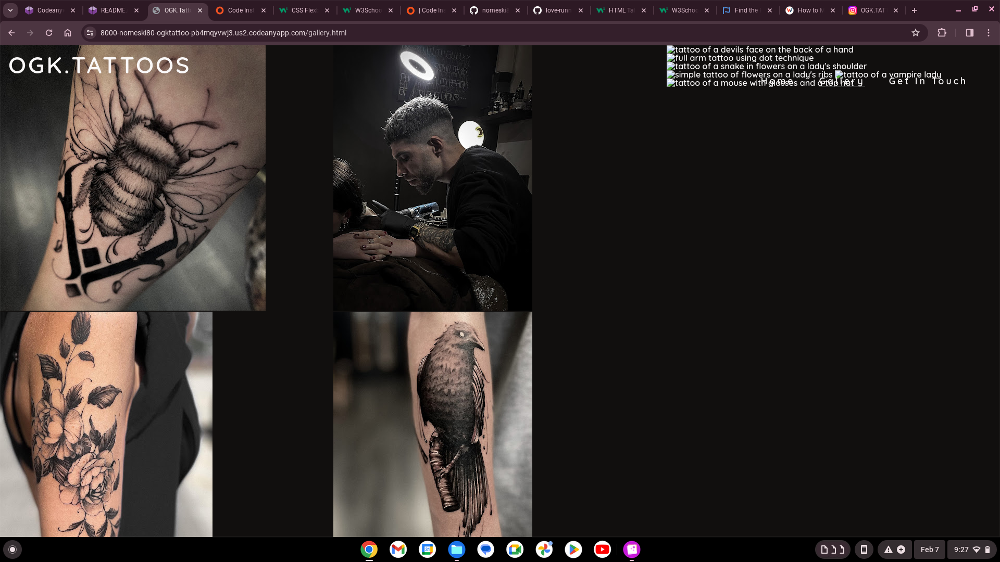

When saving the images from instagram they saved as a MHTML files. So they did not show up properly on my site. To solve this problem I went back into my folder on my laptop and saved the images again as JPEG files. Further to advice from my mentor I have converted the images to WEBP to enable better quality photos.

12/02/24
To make the gallery images responsive I wanted them to adjust the column count from 1-4 depending on the size of the screen. It was stuck between 1 and 4 for a while but then I noticed I had used the wrong ID for the 2 & 3 so I altered it and now it works.

When scrolling down the page the text from the header would overlap the content in the page. I added a background colour for the header and this had helped to make it clean and avoid the messy overlap. of the site is to help to promote the shop and the tattoo artisits' skills.

15/02/24
I am continuing to have trouble with the formatting of the form and the map on the contact us page. They are overlapping the page boundries and this shortens the footer and makes everything look out of plac
e.
# Validation
I have used a HTML validator [https://validator.w3.org/nu/#textarea], a CSS validator [https://jigsaw.w3.org/css-validator/validator] and Wave to check my site for errors [https://wave.webaim.org/]

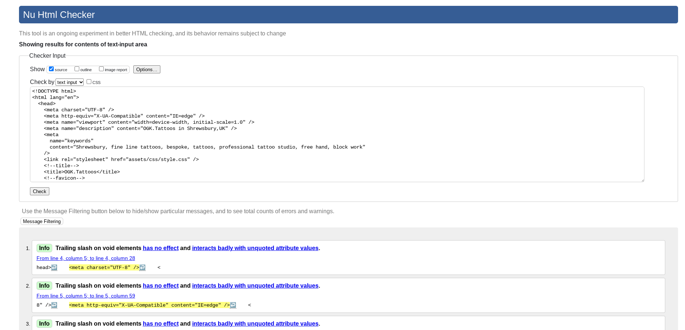
HTML tool showed me no errors on all three html pages.
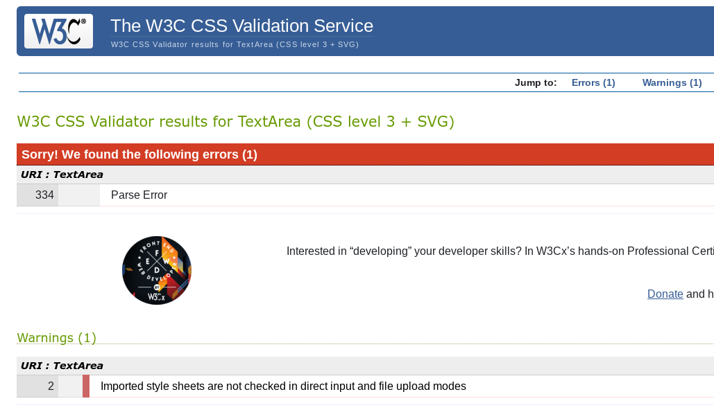
The CSS tool continued to show one error of a Parse Error. However, when I tried to resolve it there continued to show error. 
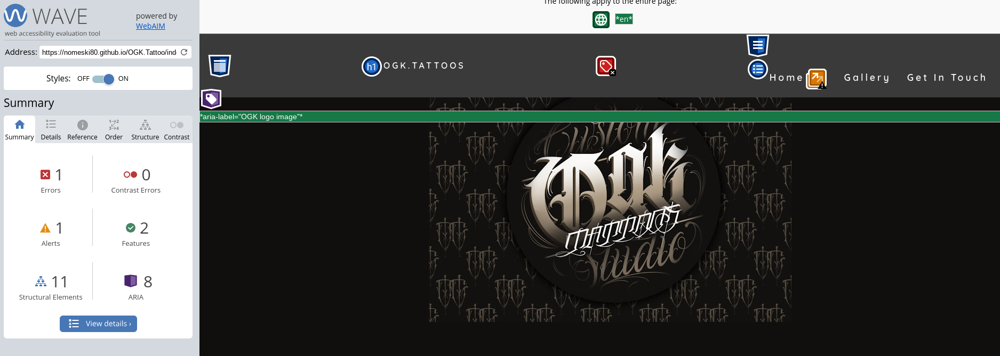
The wave tool continued to show one error of an empty form label but when I checked the error I could not see why. 

# lighthouse checker

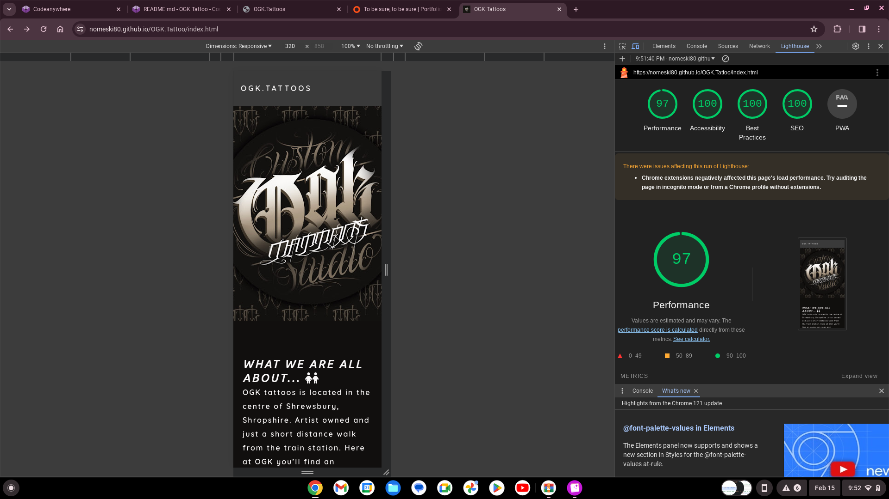
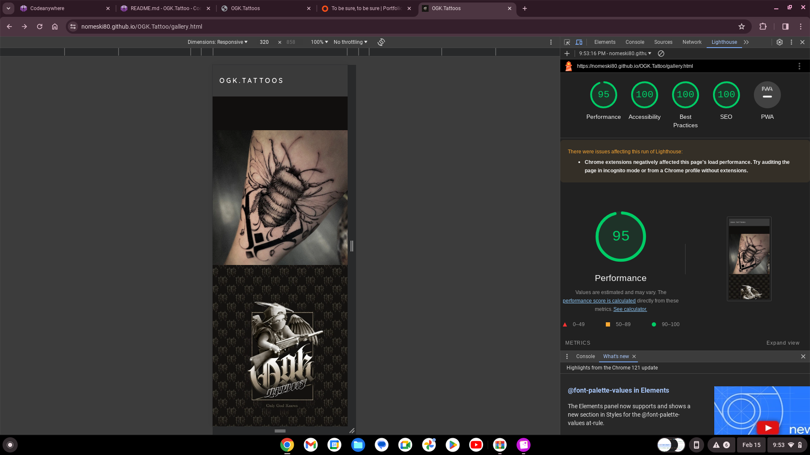
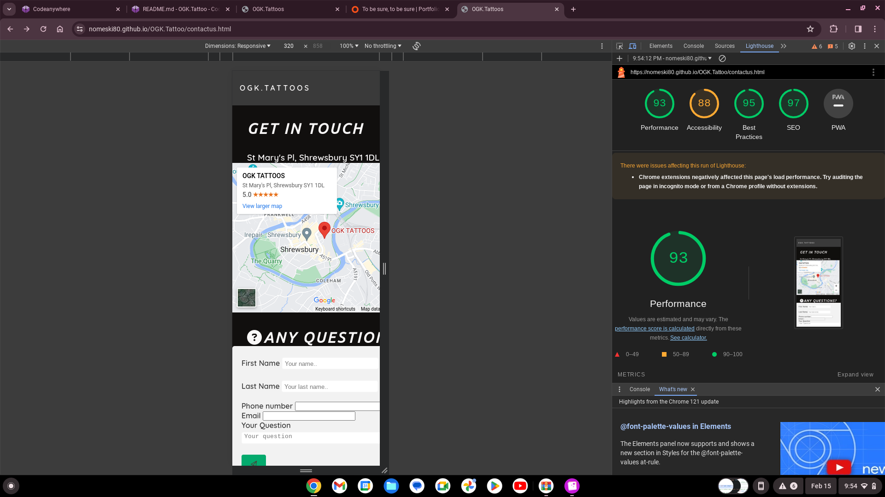
