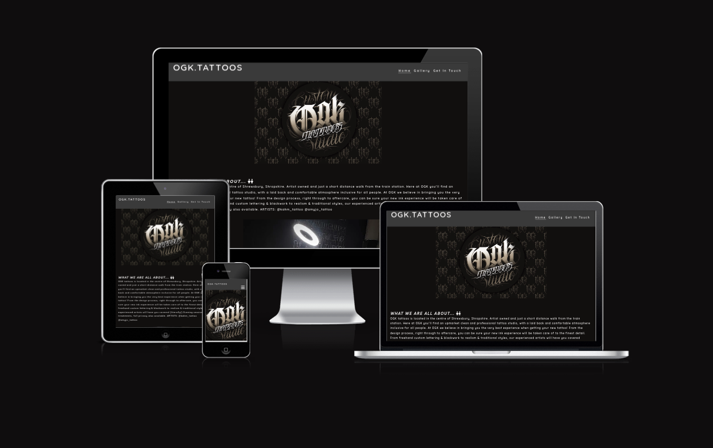
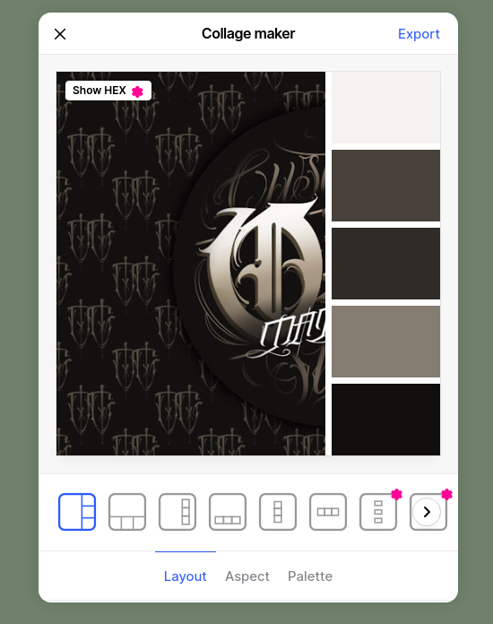
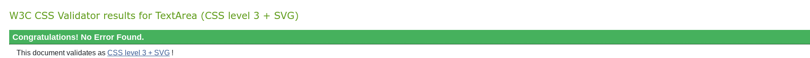
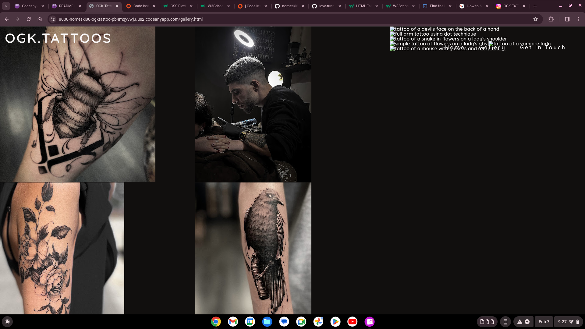

# OGK Tattoos

The OGK Tattoo website is a 3 page responsive site that users will be able to view from all media devices. The website user will be able to gain an idea as to the ethos of the shop and the artist's work. 

 [View OGK.Tattoos on Github Pages](https://nomeski80.github.io/OGKTattoo/index.html)

## Contents
* [User Experience UX](#user-experience)
* [Design](#design)
* [Technologies Used](#technologies-used)
* [Deployment](#deployment)
* [Testing](#testing-&-validation)
* [Credits](#credits)

## User Experience UX

OGK Tattoos is an independant small local busines in the heart of Shrewsbury. The owner of the shop Karm would like to promote his business and to foster a wecloming professional and creative space for people to come to. The urpose of this website to to showcase the talet the OGK tatoo artists have and to both inspire people who may be thinking about getting a new tattoo. Tattoos are big commitments and some people will want to do a lot of research before they fully commit. For this reason the website needs to look clean and simple. It should be easy to navigate and allow the user to quickly be able to gain the information needed.

The artist themselevs will then be able to showcase their work and to help people to easily contact them with any questions or enquiries. 

### Key information about the site
* To introduce and explain the shop's ethos
* How to contact the shop and ask any questions
* View example tatoos and art work
* show the opening times of the shop
* Where to find the shop with addree and map

### Client Goals
* To be able to view the site on a range of divices
* To promote the shop
* To showcase the artists work
* To allow people to contact them easily

### Visitor Goals
* To easily navigate through the site and be able to find out the required information
* To be able to dig deeper and access social media links and more upto date infromation
* To be able to contact the shop

# Design

## Colour scheme

I decided on my colour scheme by pasting the OGK logo into [coolors ](https://coolors.co/). The website uses a pallette of dark shades of brown and a contrasting off white to be consistant thoughout with the clients style. 

## Typography

To create a clean and consistent look, I selected 2 fonts from [Google fonts](https://fonts.google.com/) . 
I picked ubuntu and quicksand as I felt these were clear and easy to read. I also added a backup font of sans-serif to make sure text would be comapatible on all devices.

## Imagery

All of my images were selected with the artist's permission from his [Instagram page](https://www.instagram.com/ogk.tattoos/). After deploying my site about half way through the project the artist said he would like to have more of a say in which images we selected. I am currently waiting for him to get back to me with his choices.
I also used some icons from [https://fontawesome.com/] to help with the user experience and to be sure they could easily skim the website and look for the information they need.

## Wire frames

When planning out the site I used a mixture of 
* [Google slides](https://docs.google.com/presentation/d/1TLOV02KnPs9ocgpyYHpHy7TMzvZk3xr9N-EWinmg9XE/edit?usp=sharing) 
* [Jam board](https://jamboard.google.com/d/1QRTlp9HnB9G5tUz_PaER9yE7kofUZKb01CfLKpZWZ3A/edit?usp=sharing]) 

This helped me to map out what information I wanted and how I wanted to display everything over the different divices. I would have benefited from spending more time on this with the owner of the shop to help us both get a clear understanding of what we were aiming for early on. In the next project I will look into using Balsamiq and spend more time getting the ideas planned out and clear. I ended up wasting a few days' work by rushing to put the content up but not really thinking through the lay out so I deleted quite a bit and had to start over.

# Features

## General features

Navigation bar and menu at the top of all pages help the user to navigate easily through the pages. The logo and images display the style of the shop and showcase the artists' work. All three pages are responsive with a menu that toggles open and closed to utlise the space as needed. The images in the gallery change from 1-4 columns depending on the size of the screen to maximise the viewing options depending on the device. The OGK logo has been used as the favicon to help the user find their way back to the site if they have several tabs open at once. A map to show where the shop is has been included and this links to Google maps in another page to help the user to use directions to find the shop. At the bottom of the page are links to their social media plages so users can easily view their most recent tattoos and any up and coming offers and news that might not be updatd so quickly on a website. The contact us page allows users to connect with the shop and ask questions, this help to reduce the unmber of phone calls and interuptions for the owners. They will be able to reply and answer any questions at a time thta is convienent to them. 

## Future features

Perhaps an online booking system could be helpful. Also, more information and details about the artists themselevs. Some information about their licence and maybe some testimonials.

## Accessability
While ocding I have been mindful to make the site as accessable as possible, all images have descriptions in alt attributes that could be used as screen readers. I have decided on contrasting colours to help make the text clear and easy to read. 

# Technologies Used

## languages used

HTML and  CSS were used to code the site throughout

## Tools, plans and other programes used

[Codeanywhere](https://codeanywhere.com/) was original used in my first submission of this site then [GitPod](https://gitpod.io/workspaces) for the resubmission. Github, Dev tools, [Cloud Convert](cloudconvert.com) to convert my images and [image resizer](https://imageresizer.com/) to reduce the size of my images to help the gallery's performance in the lighthouse testing. I used [Favicon.io](Favicon.io) to create the favicon with the OGK logo. [Am I Responsive](https://ui.dev/amiresponsive) to quickly display how my pages look over different devices. 

# Deployment

Github Pages was used to deploy the live website. The instructions to achieve this are below:

1. Log in (or sign up) to Github.
2. Find the repository for this project, [OGK Tattoos](https://github.com/nomeski80/OGKTattoo).
3. Click on the Settings link.
4. Click on the Pages link in the left hand side navigation bar.
5. In the Source section, choose main from the drop down select branch menu. Select Root from the drop down select folder menu.
6. Click Save. Your live Github Pages site is now deployed at the URL shown.

## How to fork
To fork the [OGK Tattoos](https://github.com/nomeski80/OGKTattoo) repository:

1. Log in (or sign up) to Github.
2. Go to the repository for this project, (https://github.com/nomeski80/OGKTattoo).
3. Click the Fork button in the top right corner.

## How to clone 
To clone the OGKTattoo repository:

1. Log in (or sign up) to GitHub.
2. Go to the repository for this project, (https://github.com/nomeski80/OGKTattoo).
3. Click on the code button, select whether you would like to clone with HTTPS, SSH or GitHub CLI and copy the link shown.
4. Open the terminal in your code editor and change the current working directory to the location you want to use for the cloned directory.
5. Type 'git clone' into the terminal and then paste the link you copied in step 3. Press enter.

# Testing & Validation

I have used a [HTML validator](https://validator.w3.org/nu/#textarea), a [CSS validator](https://jigsaw.w3.org/css-validator/validator) and [Wave](https://wave.webaim.org/) to check my site for errors.
**Feature**|**Expected Outcome**|**Testing Performed**|**Result**|**Pass/Fail**
:-----:|:-----:|:-----:|:-----:|:-----:
home page loads as expected on desktop and mobile|Content to display clearly and centered on page|opened site|webpage opened as expected|pass 
gallery loads as expected on desktop and mobile|Content to display clearly and centered on page|opened site|webpage opened as expected|pass 
contact page loads as expected on desktop and mobile|Content to display clearly and centered on page|opened site|webpage opened as expected|pass 
links to social media in footer works|to display the social media link in a new tab|checked links|new tabs opened to display social meida links|pass
map to conect to google maps in a new tab|to display the social media link in a new tab|clicked on map|new tab opened to display google maps|pass
contact page data input to allow user to input infromation and to check data types and work |prompt if no email or phone number is entered|tried to add letters into phone number and no email in the email field|prompts did show to enter the expected data types|pass
lighthouse checks on both desktop and mobile for all three pages|>90 for each performance test|usee the lighthouse feature on all pages|mostly happy with the testing>90 on all except the gallery which came out as high 80s on deesktop and 79 on mobile|pass (except gallery)
w3c css validator|no error messages|pasted all css code into validator|no error messages|pass
nu HTML validator|no error messages|posted all HTML code from all three pages into validator|no error messages|pass
responsive pages to display content clearly on all divice types|clean clear look on all screen sizes|checked with both the inspect tool and the Am I responsive website|each page clearly shows responsive features|pass
favicon|to display logo in the tab |opened diployed page|displayes on each page|pass

HTML tool showed me no errors on all three html pages.

The CSS tool continued to show one error of a Parse Error. However, when I tried to resolve it there continued to show error. 

The wave tool continued to show one error of an empty form label but when I checked the error I could not see why. 

# lighthouse checker

## What went well, what I managed to fix and what I'm still not happy with

#resolved bugs 

Early on in the project I had trouble with CodeAnywhere but I understand this was happening for lots of people. Since then, it has been working much more smoothly and quickly. I did concidered moving over to GitPod but since it has been working fine now I have stuck with CodeAnywhere. However, for my resubmission I have been using GitPod and I have found it much more reliable and quicker!

Menu items do not stay untoggled when on the screens. Then I had issues with the toggle being hidden and making the site unusable on moblie devices. I had become confused when setting up my site and did not follow the mobile first approach. I got mixed up in trying to solve everything in media queries but eventually I stripped back my navigation and toggling code. Reviewed the Love running tutorials for this section and started over with a mobile first approach. I then had trouble with the contacts page and the bars not showing but this was due to the container for the contact us information was too big. I started to use % instead of px and this helped my screens to line up and easier to make resopnsive. 

Media query says display:block but it still works as a toggle.
The bars for the menu stick to the logo and I can not yet move them to the right. I have tried dev tools to play with padding and flex. I have tried right:0. But i can not seem to get it to work.

When adding the other pages, I had to delete a lot of the content that was already there so I could copy over the basic structure. This wasn't a big issue as the content was all overlapping and not clear. So starting that section again made more sense than fiddling around.

I had forgotten to change the toggle from X to bars icon  in the other pages. Adjustment made.

Media query for gallery is also not working, watched youtube clip to help my understanding of media queries and their format but still not working yet, making the site unresponsive for different devices. After, I took a break for the night when I check again the next day the media query did work. However the images did not look good and were not centred or in the correct places or showing the main part of the image.
 
 

When saving the images from Instagram they saved as a HTML files. So they did not show up properly on my site. To solve this problem I went back into my folder on my laptop and saved the images again as PNG files. Further to advice from my mentor I have converted the images to WEBP to enable better quality photos. He also noticed that some of my images were very big and this was slowing down the loading process, he suggesting using a resizing tool as they did not need to be so big. I went through the gallery and resized any images over 100KB.

To make the gallery images responsive I wanted them to adjust the column count from 1-4 depending on the size of the screen. It was stuck between 1 and 4 for a while but then I noticed I had used the wrong ID for the 2 & 3 so I altered it and now it works.

When scrolling down the page the text from the header would overlap the content in the page. I added a background colour for the header and this had helped to make it clean and avoid the messy overlap.

#known bugs remaining

# Credits

I started off the project relying heavily on the tutorials from the Love Running project but after talking with my mentor and exploring other websites and YouTube tutorials I gained a little more confidence in trying out tools like flex box the Box model independently to fit my website, rather than trying to fit new content into the love running set up.

Structure for this README doc was taken from readme-examples [https://github.com/kera-cudmore/readme-examples/blob/main/milestone1-readme.md#user-experience-ux]

All art work and images have come from Jack the tattoo and grafiti aritst as his own work. [https://www.instagram.com/ogk.tattoos/] most from his public page and some sent directly to me from him.

I also used w3schools.com and the code institude tutorials to help me with my understanding of forms.

I would like to thanks my mentor Graeme Taylor for his continued support and pactience.

